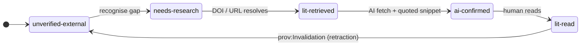

# Methodology

This file is the contract between the human author(s) and the LLM agents
defined in `agents/`. It describes *how* the paper is built, not *what* it
says.

## Primary artifacts (invariant)

Four artifacts are primary and must be **consistent and up to date at all
times**:

1. The **manuscript** (`paper/main.tex`, `paper/sections/*.tex`).
2. The **PROV-O graph** (`doc/provenance.ttl`).
3. The **logbook** (`doc/logbook.md`).
4. The **slide decks** — `slides/pitch-5min.tex` (5-minute pitch) and
   `slides/conference-30min.tex` (25 + 5 conference talk), Beamer +
   DLR Corporate Design (`slides/style/fair2r-beamer.sty`). Rendered
   PDFs are derivatives.

A working session is not complete until all four are in sync. A commit
that updates one of them and leaves the others lagging is a defect, even
if the build passes. This invariant supersedes any per-agent style rule
elsewhere in this repository. The slide decks are downstream of the
manuscript: a claim that appears on a slide must already appear in the
paper text.

## Pipeline overview

```
       human goal
            │
            ▼
   ┌────────────────┐
   │  orchestrator  │
   └───────┬────────┘
           │
   ┌───────┴────────┬──────────────┬────────────────┐
   ▼                ▼              ▼                ▼
scientific-    source-       illustration       condenser
 writer        analyzer
   │                │              │                │
   ▼                ▼              ▼                ▼
   ─────────  proposed triples  ──────────  ──────────
                       │
                       ▼
              provenance-curator ──► doc/provenance.ttl
                       │
                       ▼
              (audit pass)
                       │
        ┌──────────────┼─────────────────┐
        ▼              ▼                 ▼
  fair-aligner   layout-scrutinizer  readability-reviewer
        │              │                 │
        ▼              ▼                 ▼
                  human sign-off
                       │
                       ▼
                    git commit
                       │
                       ▼
                    logbook entry
```

## Two passes of AI

1. **Authoring pass.** `scientific-writer`, `source-analyzer`,
   `illustration`, `condenser`. AI proposes; humans dispose.
2. **Audit pass.** `fair-aligner`, `layout-scrutinizer`,
   `readability-reviewer`, `provenance-curator`. AI checks the
   manuscript and the graph against explicit criteria.

## Verification ladder


A `fair2r:Claim` carries one of:

| state | meaning |
|---|---|
| `unverified`        | Asserted but no evidence yet attached. |
| `needs-research`    | Evidence-gap acknowledged, search planned. |
| `ai-confirmed`      | An AI agent verified against a vendored or fetched source. |
| `human-confirmed`   | A human author verified the source and the inference. |
| `source-vendored`   | The source itself is in the repo under `doc/sources/`. |

A claim must reach `human-confirmed` (or `source-vendored`) before it can
appear in `main-condensed.tex`.

The states form a finite-state machine, monotone non-decreasing modulo
explicit retraction (the only legal back-edge, recorded as a
`prov:Invalidation` activity in `doc/provenance.ttl`). The diagram
below mirrors `paper/figures/ladder-fsm.mmd`, the source-of-truth
artefact for the manuscript figure of the same name.



## Definition of done for a section

1. Prose compiles in `paper/main.tex` with no `\todo` left.
2. Every claim has a `fair2r:Claim` IRI in `doc/provenance.ttl` at
   `human-confirmed` or `source-vendored`.
3. `fair-aligner` audit reports no `fail`s for the section.
4. Logbook entry committed.

## Branch and deployment policy

`main` is the default branch. All routine work goes via pull request
from feature branches into `main`; direct pushes to `main` require
explicit human-author instruction. The repository's GitHub Pages site
is configured with **Source = GitHub Actions**, deploying via
the consolidated `.github/workflows/build.yml` (`site` + `deploy`
jobs) on every push to `main`. No legacy
`gh-pages` branch is used.

## Form factor and page budget

F(AI)²R is published as a single short-form paper. The default budget
is **10 pages of body**, plus references and appendices, which do
**not** count against the budget. There is no separate condensed
manuscript; the condenser agent (`agents/condenser.md`) is repurposed
as a *page-budget enforcer* that fires when `make -C paper pages`
reports a body page count above the budget.

A budget change requires (a) human-author approval recorded in
`doc/logbook.md` and (b) a corresponding update to
`paper/Makefile` (`PAGE_BUDGET`).

## Design system

The site, the paper PDF, and (forthcoming) the slide deck follow the
**DLR Corporate Design** (CD-Handbuch §10.1 *Schriften*, §4
*Printmedien*, §10 *Wording*):

- **Type:** Frutiger 45 Light for Drucksachen; **Arial** is mandated
  for electronic channels (Web, PowerPoint, E-Mail). Tokens are
  vendored in `site/static/dlr/colors_and_type.css`; the LaTeX style
  in `paper/style/fair2r.sty` carries the same intent into the PDF.
- **Colour:** Default **DLR Blue `#00658B`**; chapter variants Green
  (`#82A043`) and Yellow (`#D2AE3D`) are available via
  `<html data-variant="b|c">` on the site or
  `\usepackage[variant=b]{style/fair2r}` in the paper.
- **Layout:** white backgrounds, generous whitespace, **square
  corners** (0–2px max), **hairline `#cfcfcf` borders**, no
  gradients in chrome, no shadows on print.
- **Voice:** precise, factual, institutional. No second person, no
  emoji, no marketing verbs. British English is the canonical English
  rendering (per CD-Handbuch §10).

The institutional imprint (Florian Krebs, ORCID 0000-0001-6033-801X,
DLR ZLP Augsburg, Helmholtz / NFDI4Ing / HMC) appears identically on
the title block of `paper/main.tex`, the `Acknowledgements` section,
the public site footer, `CITATION.cff`, `codemeta.json`, and
`.zenodo.json`. Drift between any pair is a defect surfaced by the
FAIR aligner.

## Process evolutions during cooperative writing

The methodology above is the *current* state. The cooperation that
produced this paper imposed roughly twenty structurally-significant
changes on its own scaffolding while the work was underway; they are
worth surfacing because a future cohort following this methodology
will land at most of them again. The full chronology lives in
[`doc/logbook.md`](logbook.md); the summary below groups by class.
The same digest appears as Table 1 in
`paper/sections/evolution.tex`.

| When | Class | What changed | Trigger / impact |
|---|---|---|---|
| 2026-05-06 | Rule | Primary-artefact consistency invariant | Researcher direction; orchestrator named keystone; FAIR-aligner surfaces desync as audit `fail`. |
| 2026-05-06 | Rule | Chapter-per-file rule for `.tex` | `paper/main.tex` refactored as a thin assembler; one `\section{}` per file; enabled chapter-level handback. |
| 2026-05-06 | Rule | Page budget (~10 pp body) and short-form pivot | Researcher framing as a position paper; `condenser` agent repurposed as page-budget enforcer. |
| 2026-05-06 | Rule | Source-research mandate; Consensus / Scholar default | Cut hallucinated-citation surface; paywall-escalation sub-rule shipped together. |
| 2026-05-06 | Rule | Contribution-tracking rule | Researcher question *"what is my contribution?"*; spawned `user-contributions.md` and the `fair2r:Contribution` schema branch. |
| 2026-05-06 | Schema | `fair2r:Contribution` class with seven sub-types | Operationalises the partition the Author's Note describes; mirrors per-side audit. |
| 2026-05-06 | Schema | `ai-confirmed` verification rung added | Felt cost of single-tier verification; rung added rather than weakening the existing two. |
| 2026-05-06 | Schema | `fair2r:Slidedeck` class; slides as fourth primary artefact | Researcher request for two decks; `presentation` agent owns them. |
| 2026-05-06 | Agent | `presentation` agent added to `agents/` | Slides became binding artefact; new prompt minted rather than overloading `scientific-writer`. |
| 2026-05-06 | Manuscript | Position-paper reframing | Researcher direction *"fair should be more a position paper"*; reshaped the contribution narrative. |
| 2026-05-06 | Manuscript | Author's Note carried over from `noheton/Obscurity-Is-Dead` | Voice-and-stance anchor; the methodology's first-person register lives there only. |
| 2026-05-06 | Pipeline | Static site builder + Pages workflow + paper-build CI | Made the artefact public from day one; cache-bust on the deployed site followed when staleness surfaced. |
| 2026-05-06 | Pipeline | Marp slide pipeline retired; Beamer-only | Researcher direction *"only ship beamer"*; one toolchain to maintain instead of two. |
| 2026-05-07 | Rule | DLR Corporate Design pinned for every illustrator tool | Default tool theming counts as an unfinished figure; written above the tool list, not below. |
| 2026-05-07 | Rule | Illustration toolset opened beyond TikZ (matplotlib, mermaid, networkx, graphviz, …) | Researcher direction; `ladder-populations` and `contribution-histogram` matplotlib figures unlocked. |
| 2026-05-07 | Rule | No-parentless-claim rule (every claim must name a generating activity) | Eight-claim defect found by the verification example; rule landed by the curator pass to prevent recurrence. |
| 2026-05-07 | Schema | `fair2r:repairs` object property | Curator pass: per-claim repair activity carries the reason as `rdfs:comment`; reasons are queryable. |
| 2026-05-07 | Agent | `research-protocol` agent added to `agents/` | Standalone prompt for verification-axis research notes; produced `provenance-verification.md`. |
| 2026-05-07 | Pipeline | Pages source switched from branch deploy to GitHub Actions | Default branch became `main`; CI is single source of truth for the live site. |
| 2026-05-07 | Pipeline | LaTeX-fragment stripper in the site builder | Markdown sources embedded `\emph{}`, `\textsc{}`, `\begin{enumerate}`; the rendered Pages site needed a clean prose pass. |

The catalogue is partial by construction — pure prose edits, single-paragraph
content prompts, and figure refinements that did not change the scaffolding
are recorded in `doc/user-contributions.md` (forty-eight typed entries at
time of writing) but not promoted into this digest. The cut-off rule is
*"would a future researcher following this methodology run into the same
decision?"*; if yes, the row appears here.
