# Provenance graph — human-readable view

Authoritative source: [`provenance.ttl`](provenance.ttl). This file is a
diagrammatic mirror only.

## Diagram (Mermaid)

```mermaid
flowchart TD
  subgraph agents["Agents"]
    H["fair2r:HumanResearcher<br/>agent:human-author"]
    M["fair2r:AIAgent<br/>agent:claude-opus-4-7"]
    SW["Scientific Writer"]
    SA["Source Analyzer"]
    FA["FAIR Aligner"]
    PC["Provenance Curator"]
    LS["Layout Scrutinizer"]
    RR["Readability Reviewer"]
    IL["Illustration"]
    CO["Condenser"]
  end

  subgraph plans["Plans (prompts)"]
    P_SW["agents/scientific-writer.md"]
    P_SA["agents/source-analyzer.md"]
    P_FA["agents/fair-aligner.md"]
    P_PC["agents/provenance-curator.md"]
  end

  subgraph activities["Activities"]
    A_BOOT["act:bootstrap"]
    A_AUTH["fair2r:AuthoringPass<br/>act:author-*"]
    A_FAIR["fair2r:AuditPass<br/>act:audit-fair"]
    A_LAY["fair2r:AuditPass<br/>act:audit-layout"]
    A_READ["fair2r:AuditPass<br/>act:audit-readability"]
    A_CUR["act:curate-provenance"]
    A_BLD["fair2r:Build<br/>act:build-pdf"]
  end

  subgraph entities["Entities"]
    SRC["fair2r:Source"]
    MAN["fair2r:Manuscript<br/>paper/main.tex"]
    SEC["fair2r:Section"]
    CLM["fair2r:Claim"]
    PDF["Compiled PDF"]
    GRAPH["doc/provenance.ttl"]
    V[("verif:needs-research<br/>verif:ai-confirmed<br/>verif:human-confirmed<br/>verif:source-vendored")]
  end

  H -->|"prov:actedOnBehalfOf"| SW
  H -->|"prov:actedOnBehalfOf"| SA
  H -->|"prov:actedOnBehalfOf"| FA
  H -->|"prov:actedOnBehalfOf"| PC

  SW -->|"hadPlan"| P_SW
  SA -->|"hadPlan"| P_SA
  FA -->|"hadPlan"| P_FA
  PC -->|"hadPlan"| P_PC

  A_BOOT -->|"prov:wasAssociatedWith"| M
  A_BOOT -->|"prov:wasAssociatedWith"| H
  A_BOOT -->|"prov:used"| SRC
  A_BOOT -->|"prov:generated"| MAN

  A_AUTH -->|"prov:wasAssociatedWith"| SW
  A_AUTH -->|"prov:used"| SRC
  A_AUTH -->|"prov:generated"| SEC
  A_AUTH -->|"prov:generated"| CLM

  SEC -->|"prov:hadPrimarySource"| MAN

  A_FAIR -->|"prov:wasAssociatedWith"| FA
  A_LAY  -->|"prov:wasAssociatedWith"| LS
  A_READ -->|"prov:wasAssociatedWith"| RR

  A_FAIR -->|"prov:used"| MAN
  A_LAY  -->|"prov:used"| MAN
  A_READ -->|"prov:used"| MAN

  A_CUR -->|"prov:wasAssociatedWith"| PC
  A_CUR -->|"prov:generated"| GRAPH

  A_BLD -->|"prov:used"| MAN
  A_BLD -->|"prov:generated"| PDF
  PDF  -->|"prov:wasDerivedFrom"| MAN

  CLM -->|"fair2r:verificationState"| V
```



## Reading the graph

Three concentric loops:

1. **Authoring loop** (left).
   `Human author → Plan (prompt) → AI Agent → Activity → Section / Claim`.
   Output: prose plus proposed triples.

2. **Audit loop** (right).
   `AI Agent (FAIR / Layout / Readability) → Activity → Audit report`.
   Output: pass/warn/fail records that gate the next commit.

3. **Curation loop** (bottom).
   `Provenance Curator → curate-provenance activity → doc/provenance.ttl`.
   The *only* activity allowed to write the graph itself.

The `Build` activity is independent of all three: it consumes the
manuscript and emits the PDF, and is reproducible from the repository
alone. That reproducibility is the F(AI)²R closure: the audit AI can
replay the build, walk the graph, and verify that every claim in the
PDF traces back to either a human author or a vendored source.

## Worked verification example

The schematic above shows what the graph *should* look like; this
section shows what it currently *does* look like, walked by a few
SPARQL queries against the live `doc/provenance.ttl`. The longer
treatment of the verification programme (SHACL, SPARQL, model
checking, theorem proving) lives in
[Provenance verification](provenance-verification.html). The point of
the example below is concrete: a reader of this site, today, can run
the same queries with `rdflib` (or Apache Jena `arq`) and reproduce
the numbers without trusting the prose.

### 1. Per-claim provenance trail (a sample)

The shape of a complete claim record is `(claim, activity, agent,
rung)` — a four-element tuple stating *who* generated *what*
through *which* activity, and at *which* level of confidence. The
following query returns one row per claim and lets a reader
recompute the rung distribution without re-reading the prose.

```sparql
PREFIX fair2r: <https://noheton.org/f-ai-r/ns#>
PREFIX prov:   <http://www.w3.org/ns/prov#>
SELECT ?claim ?rung WHERE {
  ?claim a fair2r:Claim ;
         prov:wasGeneratedBy   ?activity ;
         prov:wasAttributedTo  ?agent ;
         fair2r:verificationState ?rung .
} ORDER BY ?rung ?claim LIMIT 8
```

A representative slice of the result against the graph at the time of
this commit:

| Claim                            | Rung               |
|----------------------------------|--------------------|
| `ai-rise-motivation`             | `ai-confirmed`     |
| `base-rates-distinct`            | `ai-confirmed`     |
| `practice-disclosure`            | `ai-confirmed`     |
| `cache-bust-versioning`          | `human-confirmed`  |
| `consensus-scholar-default`      | `human-confirmed`  |
| `equity-not-neutral`             | `human-confirmed`  |
| `frontier-model-dependence`      | `human-confirmed`  |
| `consistency-invariant-binding`  | `source-vendored`  |

Aggregating across all claims gives the canonical distribution table:
21 `human-confirmed`, 9 `source-vendored`, 5 `ai-confirmed`, 2
`needs-research`. This is the same distribution that
`scripts/provenance_analysis.py` writes into the auto-generated
table consumed by `paper/sections/provenance-analysis.tex`; the
manuscript and the graph agree because they are reading the same
source.

### 2. Structural defect detection (a SHACL preview)

`SELECT` queries surface what is present; the more interesting use is
surfacing what is *missing*. The implicit invariant for a well-formed
claim — at least one `prov:wasGeneratedBy`, at least one
`prov:wasAttributedTo`, exactly one `fair2r:verificationState` — is
not yet enforced in `doc/provenance.ttl`. A starter SHACL shape would
be:

```turtle
fair2r:ClaimShape  a sh:NodeShape ;
    sh:targetClass fair2r:Claim ;
    sh:property [ sh:path prov:wasGeneratedBy ; sh:minCount 1 ] ;
    sh:property [ sh:path prov:wasAttributedTo ; sh:minCount 1 ] ;
    sh:property [ sh:path fair2r:verificationState ;
                  sh:minCount 1 ; sh:maxCount 1 ] .
```

The same invariant, expressed as a SPARQL conformance query, returns
the claims a SHACL run would flag:

```sparql
PREFIX fair2r: <https://noheton.org/f-ai-r/ns#>
PREFIX prov:   <http://www.w3.org/ns/prov#>
SELECT ?claim ?missing WHERE {
  ?claim a fair2r:Claim .
  OPTIONAL { ?claim prov:wasGeneratedBy ?g . }
  OPTIONAL { ?claim prov:wasAttributedTo ?a . }
  OPTIONAL { ?claim fair2r:verificationState ?v . }
  BIND( IF(!BOUND(?g), "wasGeneratedBy",
        IF(!BOUND(?a), "wasAttributedTo",
        IF(!BOUND(?v), "verificationState", "OK"))) AS ?missing)
  FILTER(?missing != "OK")
}
```

Run against the current graph the query returns **8 claims missing a
`prov:wasGeneratedBy` triple** — a real, currently-uncorrected
structural defect that the prose has not yet noticed:

| Claim                              | Missing property         |
|------------------------------------|--------------------------|
| `domain-ontologies-extension`      | `prov:wasGeneratedBy`    |
| `reproducibility-baseline-poor`    | `prov:wasGeneratedBy`    |
| `reviewer-side-ai-policies`        | `prov:wasGeneratedBy`    |
| `bioinformatics-precedent`         | `prov:wasGeneratedBy`    |
| `journal-as-distribution-in-decline` | `prov:wasGeneratedBy`  |
| `authors-note-voice-exception`     | `prov:wasGeneratedBy`    |
| `formal-methods-cousin`            | `prov:wasGeneratedBy`    |
| `contribution-tracking-rule`       | `prov:wasGeneratedBy`    |

The defect is benign — these claims were authored by the human in a
prompt-driven session and the activity was conflated with the
session-level `act:author-*` parent. A SHACL pass added to CI would
fail the build and force the curator to add the missing edges. That
is the first concrete win the verification programme would buy.

### 3. Reproducing locally

```bash
python3 -c "
from rdflib import Graph
g = Graph(); g.parse('doc/provenance.ttl', format='turtle')
print(len(g), 'triples')
"
```

Then either paste the queries above into `g.query(...)` or, for a
heavier session, load the same file into Apache Jena's `arq` REPL.
The `pyshacl` runner against the starter shapes is the next step the
[verification scoping doc](provenance-verification.html) describes.
